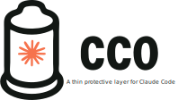

<div align="center">
    
</div>
<hr>


**cco** (Claude Condom if you're so inclined) provides essential protection while Claude Code is up close and personal with your system. It automatically selects the best available sandboxing method - using native OS sandboxing (sandbox-exec on macOS, bubblewrap on Linux) when available, or falling back to Docker as a barrier to keep Claude contained while keeping your real system safe.

**UPDATE**: `cco` can now sandbox OpenAI's `codex` as well! Just start it with `cco codex` to don your codex condom! ([Opencode](https://github.com/anomalyco/opencode), [Pi coding agent](https://github.com/badlogic/pi-mono/tree/main/packages/coding-agent), and factory.ai's [droid](https://factory.ai/) are supported as well.)

## Why protection matters

Running Claude Code with `--dangerously-skip-permissions` feels great - fast, responsive, no interruptions. But going in unprotected has risks: web search makes Claude vulnerable to prompt injections that could trick it into accessing files outside your project or running unexpected commands.

**`cco` lets you have it both ways: all the pleasure of autonomous Claude, with a barrier between Claude and your machine's sensitive areas.**

### The problem with exposure
- **Leaves Claude Unprotected**: Lightning fast but vulnerable to nasty prompt injections
- **Mood killer**: Constant permission prompts kill the flow

### Protected interaction
- **Smooth operation**: No more constant permission prompts
- **Barrier protection**: Keeps unwanted side effects contained
- **Peace of mind**: Enjoy the experience without worry
- **Easy cleanup**: Fresh environment every time

For more information about `cco`'s security model, limitations, and threat analysis, see [SECURITY.md](SECURITY.md).

## Quick start

### Installation
```bash
curl -fsSL https://raw.githubusercontent.com/nikvdp/cco/master/install.sh | bash
```

### Usage
Just type `cco` where you would normally type `claude` and your protection is on!

```bash
cco "write a hello world script"
cco "help me refactor this code"
```

## Design philosophy

**`cco` gets out of your way.** It's designed to feel natural - like using Claude directly, just safer.

- **Thin layer**: Barely noticeable protection
- **Natural feel**: Works exactly like `claude` but protected
- **No surprises**: Everything you expect, just contained
- **Seamless experience**: Your environment, your files, your workflow

You should barely notice `cco` is there, except for that reassuring feeling of safety.

## How it works

**`cco` runs Claude Code inside a sandboxed environment.** It automatically detects and uses the best available sandboxing method:

- **Native sandboxing (default when available)**: Uses OS-native tools (sandbox-exec on macOS, bubblewrap on Linux) for lightweight, fast isolation. **Note**: Native sandboxing exposes the entire host filesystem as read-only by default - use `--safe` for stronger filesystem isolation.
- **Docker sandboxing (fallback)**: Uses Docker containers when native tools aren't available. Provides stronger filesystem isolation by only exposing explicitly mounted paths.

- **Automatic sandbox selection**: Chooses native OS sandboxing when available, Docker as fallback
- **Native sandbox (preferred)**: Lightweight, fast startup, direct Keychain access on macOS. Exposes host filesystem read-only by default.
- **Docker sandbox (fallback)**: Stronger filesystem isolation with container-only filesystem when native tools unavailable
- **Host file access**: Your project files are accessible so Claude can read and edit them
- **Git worktree support**: Automatically detects git worktrees and whitelists the main repo's `.git` directory so git operations work seamlessly
- **Network access**: Full host network access for localhost development servers, MCP servers, and web requests
- **Credential management**: Authentication is handled securely without exposing host credentials
- **Enhanced features**: Background tasks enabled by default for improved code analysis and autonomous development (Docker mode)
- **Full toolchain**: Docker container includes development tools, languages, and utilities Claude needs

The result? Claude gets the `--dangerously-skip-permissions` experience it needs to be productive, while potential risks are contained within the sandbox.

## Why cco vs alternatives?

There are several alternatives for running Claude Code in containers:
- [Anthropic's official devcontainer spec](https://docs.anthropic.com/en/docs/claude-code/devcontainer) for VS Code
- [claudebox by RchGrav](https://github.com/RchGrav/claudebox) - a feature-rich container environment
- Basic Docker approaches

Here's why cco is the better choice for developers who want simplicity and seamless integration:

### Simplicity and workflow
- **One command**: `cco "help me code"` - that's it. Devcontainers require VS Code setup, configuration files, and "Reopen in Container"
- **No IDE dependency**: Works in any terminal, no VS Code required. Devcontainers are VS Code-specific
- **Instant startup**: Spins up immediately, no container rebuilding. Devcontainers rebuild on configuration changes
- **Zero configuration**: Install once, works everywhere. Devcontainers need devcontainer.json setup per project
- **Pass-through arguments**: All Claude Code options work normally (`--resume`, `--model`, etc.) without configuration

### First-class macOS support
- **Keychain integration**: Automatically extracts Claude Code credentials from macOS Keychain. Devcontainers require manual credential setup
- **User mapping**: Handles macOS UIDs (501) vs Linux container UIDs automatically. Devcontainers use generic container users
- **File permissions**: Perfect permission mapping between macOS host and Linux container without configuration
- **Platform detection**: Smart platform-specific logic. Devcontainers use one-size-fits-all approach

### Terminal responsiveness
- **Window resizing works properly**: When you resize your terminal, Claude's interface adapts in real-time (via SIGWINCH signal forwarding). Devcontainers don't handle this
- **Native terminal feel**: Interactive terminal interface works exactly like native Claude Code
- **Real-time interface updates**: Claude's TUI reflows and adapts when you resize your terminal window
- **Full signal support**: All terminal signals work properly, not just basic input/output

### Credential security
- **Zero credential baking**: Credentials never get built into Docker images, unlike some devcontainer setups
- **Runtime-only mounting**: Secure credential extraction and temporary mounting. Devcontainers often persist credentials in container
- **Cross-platform auth**: Works with macOS Keychain, Linux files, and environment variables automatically
- **No manual setup**: Finds and uses credentials without devcontainer configuration

### Development workflow integration  
- **Project-aware**: Container names based on directory, proper working directory handling. Devcontainers use generic naming
- **MCP server compatibility**: Host networking enables localhost MCP servers without configuration. Devcontainers may require network setup
- **Environment inheritance**: Terminal settings, Git config, locale automatically available. Devcontainers need explicit environment configuration
- **Smart caching**: Uses previous images as build cache for faster rebuilds without configuration

### Feature comparison

| Feature                  | cco                              | claudebox                     | devcontainer              |
|--------------------------|----------------------------------|-------------------------------|---------------------------|
| **Setup complexity**     | One command install              | Multi-step setup, profiles    | VS Code + config files    |
| **IDE dependency**       | None                             | None                          | VS Code required          |
| **Startup time**         | Instant                          | Slower (profile builds)       | Container rebuild delays  |
| **macOS Keychain**       | Automatic                        | Manual setup                  | Manual setup              |
| **Terminal resizing**    | Automatic (SIGWINCH passthrough) | Unknown                       | Limited                   |
| **Configuration**        | Zero config                      | Profile management            | devcontainer.json         |
| **Development profiles** | None needed                      | 15+ profiles                  | Basic                     |
| **Project isolation**    | Basic                            | Advanced (per-project images) | Basic                     |
| **Philosophy**           | Invisible simplicity             | Feature-rich environment      | IDE integration           |

**Choose devcontainer if you:**
- Want VS Code integration and IDE features
- Need team collaboration and shared environments  
- Require sophisticated firewall rules and network restrictions

**Choose claudebox if you:**
- Want extensive development profiles (C++, Python, Rust, etc.)
- Need per-project Docker images and isolation
- Want comprehensive package management and firewall control
- Don't mind setup complexity for feature richness

**Choose cco if you:**
- Live in the terminal and want Claude Code to feel native
- Want the simplest possible secure Claude setup  
- Prefer zero configuration over feature customization
- Value instant startup and seamless macOS integration

`cco` isn't trying to be a development environment - it's trying to be invisible protection that lets you use Claude Code exactly as intended, just safely.

## Installation

### One-liner install
```bash
curl -fsSL https://raw.githubusercontent.com/nikvdp/cco/master/install.sh | bash
```

### Manual setup
```bash
git clone https://github.com/nikvdp/cco.git
cd cco
chmod +x cco
sudo ln -s "$PWD/cco" /usr/local/bin/cco
```

## Usage

### Basic operation
```bash
# Interactive session
cco

# Direct commands  
cco "analyze this codebase"
cco --resume  # Claude Code option passed through

# Get help
cco --help
```

### Advanced options
> ⚠️ **Beta security trade-offs**: `--docker-socket` and `--allow-oauth-refresh` weaken isolation. Only enable them if you fully understand and accept the risks (host Docker control, host credential writes).
```bash
# Force a specific sandbox backend
cco --backend native  # Use native sandbox (sandbox-exec/bubblewrap)
cco --backend docker  # Use Docker sandbox
cco --backend auto    # Auto-detect (default)

# Rebuild the protective layer (Docker mode only, also updates to latest Claude Code version)
cco --rebuild

# System information and status
cco --info

# Shell access for inspecting the container environment
cco shell
cco shell 'ls -la'  # Run shell commands inside the cco container

# Custom environment
cco --env API_KEY=sk-123

# Additional apt packages
cco --packages terraform,kubectl

# Enable Docker access
cco --docker-socket

# Update cco installation
cco self-update

# Clean up containers
cco cleanup

# Safe mode (native sandbox): hide $HOME for stronger isolation (experimental)
cco --safe

# Share directories read-only or hide them
cco --add-dir ~/configs:ro
cco --allow-readonly ~/.ssh
cco --deny-path ~/Downloads
```

- `--docker-socket` (experimental): Binds the host Docker socket into the sandbox so Claude can control Docker on your machine. This defeats the isolation barrier—avoid unless you explicitly need host Docker access.
- `--force-docker-bridge-network` (Docker only): Force bridge networking instead of host networking. By default cco uses `--network=host` when available (Linux, OrbStack). Use this if you need port isolation or want explicit `-p` port forwarding.
- `--allow-oauth-refresh` (experimental): Gives the container write access to your Claude credentials so refreshed tokens sync back to the host. Malicious prompts could corrupt or replace those credentials.
- `--safe` (native only, experimental): **Provides stronger filesystem isolation** by hiding your entire `$HOME` directory from Claude. Only the project directory and explicitly shared paths remain visible. **Trade-off**: Increased security but may cause some tools to fail if they need access to configuration files in `$HOME`. Use `--allow-readonly` to selectively expose needed paths.
- `--allow-readonly PATH`: Share extra files or directories read-only inside the sandbox.
- `--deny-path PATH`: Deny read/list/write access to a path so it is fully inaccessible to Claude.

### Allow paths inside deny paths

You can create exceptions within denied paths by combining `--deny-path` with `--allow-readonly` or `--add-dir`:

```bash
# Deny all of /run but allow access to a specific socket
cco --deny-path /run --allow-readonly /run/user/1000/pipewire-0

# Deny a config directory but allow a specific subdirectory
cco --deny-path ~/.config --add-dir ~/.config/myapp
```

**Precedence rules:**
- Allow paths that are subpaths of denied paths act as specific exceptions
- The denied parent remains inaccessible (no read/list/write) except for explicitly allowed subpaths
- Works consistently on both Linux (bubblewrap) and macOS (Seatbelt)

### Sandbox Backend Passthrough (`--`)

Arguments after `--` are passed directly to the underlying sandbox backend (Docker, bwrap, or sandbox-exec). This enables advanced configuration like port forwarding without `cco` needing explicit flags for every option:

```bash
# Forward ports for development servers (Docker mode)
cco -- -p 3000:3000                      # Forward port 3000
cco -- -p 3000:3000 -p 8080:8080         # Forward multiple ports
cco -- -e "MESSAGE=hello world"          # Set env with spaces
```

Shell quoting is preserved - each argument after `--` remains a separate argv element.

### Persistent Sandbox Args (`CCO_SANDBOX_ARGS_FILE`)

For persistent configuration, set `CCO_SANDBOX_ARGS_FILE` to point to a file containing sandbox backend arguments (one per line):

```bash
export CCO_SANDBOX_ARGS_FILE=~/.config/cco/sandbox-args
```

Example file (`~/.config/cco/sandbox-args`):
```
# Forward dev server port
-p
3000:3000
# Forward database port  
-p
5432:5432
# Custom environment
-e
DATABASE_URL=postgres://localhost/mydb
```

**Format rules:**
- One argument per line (flag and value on separate lines)
- Lines starting with `#` are comments
- Empty lines are ignored
## Command Pass-through

`cco` acts as a wrapper - any options it doesn't recognize get passed directly to Claude Code:

```bash
# These Claude Code options work normally
cco --resume
cco --model claude-3-5-sonnet-20241022 "write tests"
cco --no-clipboard "analyze this file"

# Mix cco and Claude options
cco --env DEBUG=1 --resume  # `cco` + Claude options
```

### Run Arbitrary Commands (`--command`)

You can use `cco` as a generic sandbox wrapper for any CLI, not just Claude. This is helpful when you want a tool to run with full autonomy inside a contained environment.

```bash
# Run a shell inside the sandbox
cco --command "bash"

# Run a custom program in the sandbox
cco --command "python3" - <<'PY'
print("hello from inside cco")
PY

# With additional project directories mounted read/write
cco --add-dir ~/work/secrets --command "ripgrep TODO"
```

Notes:
- `--command` replaces the Claude invocation; all following args are passed to your command as-is.
- `cco` does not add Claude-specific flags to your command (e.g., it won’t append `--dangerously-skip-permissions`).
- Native/Docker sandboxing still applies, so the command runs contained with only the mounted paths available.
- Combine with `--allow-readonly` / `--deny-path` / `--add-dir ...:ro` to tighten what your command can read or modify.

### Codex Mode (`cco codex`)

`cco codex` is a convenience for running OpenAI’s Codex CLI with maximum autonomy while keeping it contained by `cco`.

What it does:
- Sets the command to `codex --dangerously-bypass-approvals-and-sandbox` so `codex` won’t prompt for permissions and can act autonomously.
- Mounts `~/.codex` into the sandbox so `codex` can access it.
- Leaves containment to `cco` (native Seatbelt/bubblewrap or Docker), so `codex` cannot escape mounted paths even with bypass flags.

Examples:
```bash
# Start Codex inside cco's sandbox
cco codex "build and run a small demo"

# Equivalent manual form using --command (when ~/.codex exists)
cco --add-dir ~/.codex --command "codex --dangerously-bypass-approvals-and-sandbox" "build and run a small demo"

# Add extra directories Codex should be able to access
cco --add-dir ~/.codex --command "codex --dangerously-bypass-approvals-and-sandbox" "analyze this project"
```

Security note: `--dangerously-bypass-approvals-and-sandbox` applies to Codex’s internal permission checks, not to `cco`. The `cco` sandbox still constrains filesystem access to your project and explicitly mounted paths. Network access remains unrestricted by design.

## MCP Server Support

`cco` uses host-based networking so that MCP (Model Context Protocol) servers or other tools you may have running on localhost are accessible to `cco`.

- **OrbStack**: Native host networking support - MCP servers on localhost work automatically
- **Docker Desktop 4.34+**: Host networking available - enable in Settings → Resources → Network
- **Older Docker**: Uses `host.docker.internal` bridge - may require MCP server reconfiguration

If you're using MCP servers with localhost addresses and they're not accessible, consider:
1. Upgrading to Docker Desktop 4.34+ or switching to OrbStack
2. Reconfiguring MCP servers to use `host.docker.internal` instead of `localhost`

### Stdio-based MCP Servers

**Important**: Stdio-based MCP servers need to be installed inside the container. `cco` cannot access stdio-based MCP servers that you have installed on your Mac/host system.

This is because stdio MCP servers run as separate processes that Claude Code launches directly, and the container can only see programs installed within it.

**If installable via apt:**
```bash
cco --packages your-mcp-server-package "help me code"
```

**For custom installation, modify the Dockerfile:**
```bash
# Clone or fork the cco repository
git clone https://github.com/nikvdp/cco.git
cd cco

# Edit the Dockerfile to add your MCP server installations
# Add lines like these before the final ENTRYPOINT/CMD:
# RUN apt-get update && apt-get install -y your-mcp-server
# RUN pip install your-python-mcp-server  
# RUN npm install -g your-nodejs-mcp-server

# Build your custom image
./cco --rebuild "help me with MCP server functionality"
```

## Configuration

### Environment setup
`cco` passes through everything you need:
- `ANTHROPIC_API_KEY` - Direct access
- Terminal settings (`TERM`, `NO_COLOR`)
- Git configuration
- Locale and timezone
- Claude Code background tasks enabled by default (use `--disable-background-tasks` to turn off)

### Project-level config
```bash
# Use .env files
echo "DEBUG=1" > .env
cco
```

## Requirements

- **Sandbox backend**: ONE of the following:
  - **macOS**: sandbox-exec (built-in) OR Docker
  - **Linux**: bubblewrap (bwrap) OR Docker
- **Claude Code**: Must be authenticated (run `claude` and login)
- **Bash**: For the wrapper

### Authentication
`cco` automatically finds your Claude credentials:
- **Native sandbox mode**:
  - **macOS**: Direct Keychain access via sandbox-exec
  - **Linux**: Direct file access via bubblewrap
- **Docker sandbox mode**:
  - **macOS**: Extracts from Keychain and mounts securely
  - **Linux**: Mounts `~/.claude/.credentials.json` or config directory
- **Environment**: `ANTHROPIC_API_KEY` passed through in both modes

## Architecture

### Filesystem Isolation Comparison

Understanding the filesystem isolation differences between sandbox modes:

| Sandbox Mode | Host Filesystem Visibility | Isolation Level | Performance | Use Case |
|--------------|----------------------------|-----------------|-------------|----------|
| **Docker** | Only mounted paths | **Strongest** | Slower startup | Maximum security |
| **Native** | Entire host (read-only) | **Basic** | Fastest startup | Development convenience |
| **Native + `--safe`** | Only project + whitelisted | **Strong** | Fast startup | Security + performance balance (experimental) |

**Key Points:**
- **Native sandbox (default)**: Exposes your entire host filesystem as read-only. Claude can read any file your user can read, but can only write to the project directory.
- **Docker sandbox**: Only shows explicitly mounted paths. Claude cannot see or read files outside mounted directories.
- **`--safe` flag** (experimental): Available only with native sandboxing. Hides your `$HOME` directory entirely while keeping fast native performance. May cause some tools to fail if they require access to dotfiles or configuration in `$HOME`.

**Security recommendation**: Use Docker mode for maximum filesystem isolation, or try `--safe` with native sandboxing for better security with fast performance (experimental - may require `--allow-readonly` for some tools).

### Sandbox modes

#### Native sandboxing (default when available)
- **macOS**: Uses sandbox-exec (Seatbelt) for OS-level isolation
- **Linux**: Uses bubblewrap for lightweight containerization
- **Benefits**: Fast startup, no Docker overhead, direct system integration

#### Docker sandboxing (fallback)
- **Container specs**:
  - Node.js 20 with development tools
  - Modern CLI utilities (jq, ripgrep, fzf)
  - Multiple language support
  - Database clients and network tools

### Safety features
- **Filesystem isolation**: Level depends on sandbox mode
  - **Docker mode**: Only project and explicitly mounted paths visible
  - **Native mode (default)**: Entire host filesystem visible read-only, project read/write
  - **Native + `--safe`**: Only project and whitelisted paths visible (stronger isolation)
- **Write protection**: All modes prevent writes outside project directory
- **Secure credential mounting**: Runtime-only credential access
- **Fresh session isolation**: Clean environment for each session
- **Terminal injection protection**: Linux sandbox blocks TIOCSTI/TIOCLINUX attacks via seccomp filtering

## Examples

### Development workflow
```bash
cd my-project
cco
cco "add tests to the auth module"
cco --resume
```

### CI/CD usage
```bash
export ANTHROPIC_API_KEY=sk-key
cco "review this pull request"
```

## Experimental Features

⚠️ **These features are experimental and may have edge cases. Use with caution.**

```bash
# OAuth token refresh (EXPERIMENTAL)
# Allows Claude to refresh expired tokens and sync back to host system
cco --allow-oauth-refresh "help me code"

# Credential management (EXPERIMENTAL)  
# Backup and restore Claude Code credentials for safety
cco backup-creds                    # Backup current credentials
cco restore-creds                   # Restore from most recent backup
cco restore-creds backup-file.json  # Restore from specific backup
```

**OAuth refresh feature**: Enables bidirectional credential sync when Claude refreshes expired tokens. Uses race condition protection and creates automatic backups.

**Credential management**: Provides manual backup/restore of Claude Code credentials with cross-platform support (macOS Keychain + Linux files).

## Troubleshooting

**Authentication issues**
- Run `claude` first to authenticate
- Check Claude works outside `cco`

**Token expiration**
- If you get authentication errors, your OAuth token may have expired
- The containerized environment prevents automatic token refresh by default
- **Solution**: Run `claude` directly (outside `cco`) to re-authenticate, then retry with `cco`
- For automatic token refresh, the beta `--allow-oauth-refresh` flag will sync container credentials back to your host. Only use it if you accept the additional credential tampering risk.

**Docker problems**
- Start Docker daemon
- Verify with `docker info`

**Permission errors**
- `cco` handles user mapping automatically
- Try `cco --rebuild` if needed

**Experimental features not working**
- OAuth refresh (`--allow-oauth-refresh`) is beta, reduces credential isolation, and may have issues
- Fallback: authenticate directly with `claude` when tokens expire
- Use credential backup/restore commands for safety: `cco backup-creds` / `cco restore-creds`

### Known Issues

**Token expires during active session (macOS)**
If Claude stops responding with API errors during an active `cco` session, your OAuth token has likely expired mid-session. This is primarily a macOS issue due to credential storage differences.

**Root cause**: When Claude Code runs inside the Linux container, it cannot directly update the macOS Keychain on the host system where credentials are stored. The OAuth refresh call is "coming from inside the house" but can't reach the host Keychain.

**Workaround**:
1. Open a new terminal window
2. Run `claude` (outside `cco`) 
3. Run `/login` to re-authenticate
4. Exit the raw claude session
5. Quit your current `cco` session
6. Restart with `cco --resume` to pick up the refreshed credentials

**Linux note**: This issue may not affect Linux systems where credentials are file-based and can potentially be updated with `--allow-oauth-refresh` flag, though this needs more testing.

*PRs welcome to investigate cross-platform solutions for seamless credential refresh.*

**Stdio-based MCP servers not available**
If Claude reports that stdio-based MCP servers are not found or not working, they need to be installed inside the container. See [MCP Server Support](#mcp-server-support) section for installation instructions.

### Debug access
```bash
cco shell  # Get inside for inspection
cco --info  # Check system status
```

## Security

`cco` provides protection primarily through filesystem isolation and credential management. **Important limitations to understand:**

### What `cco` protects against:
- Uncontrolled file system access outside your project
- Credential exposure and improper credential handling
- System-level changes that persist after sessions

### What `cco` does NOT protect against:
- **Network security**: Claude has full access to your network and localhost services
- **Data exfiltration**: Claude can still make web requests and access network resources
- **Local service access**: Claude can connect to databases, APIs, and other services on your system

**Network access is intentionally unrestricted** to support MCP servers and maintain Claude's full functionality. The primary security benefits come from filesystem and credential isolation, not network isolation.

**For detailed security information, threat model, and limitations, see [SECURITY.md](SECURITY.md).**

**Practice safe computing.**

## Contributing

Pull requests welcome! Please maintain all safety mechanisms.

## License

MIT License
